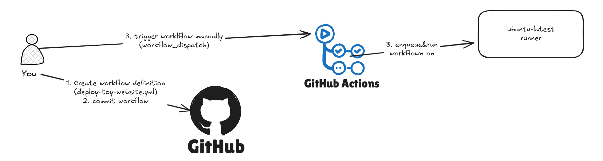
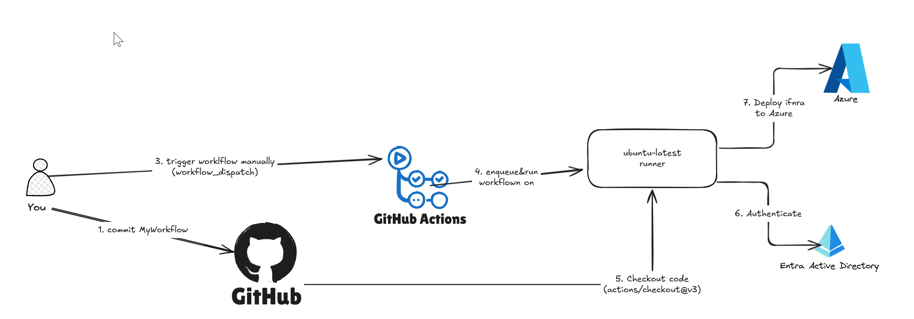
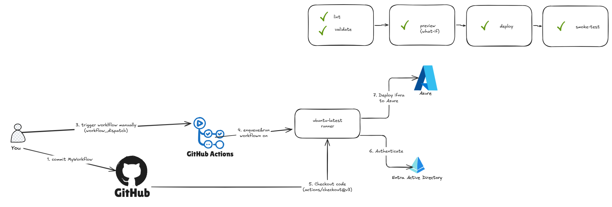
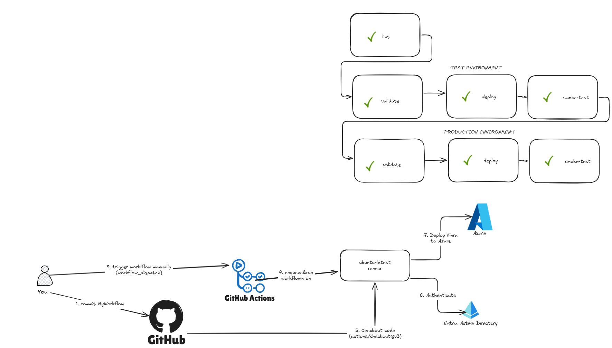

# Global Azure workshop in Gdansk: Deploy on Azure by using Bicep and GitHub
>🎯 Goal: build deploy sample BICEP template with GitHub Actions

# agenda
## 💻Excercise #1 Create GitHub repo & run hello world workflow


assets:
* [.github\workflows\deploy-toy-website-v1.yml](.github\workflows\deploy-toy-website-v1.yml)


## 💻 Excercise #2 generate Azure credentials, configure action, deploy Bicep using workflow


assets:
* [scripts\excercise3.sh](.\scripts\excercise2.sh)
* [.github\workflows\deploy-toy-website-v2.yml](.github\workflows\deploy-toy-website-v2.yml)
* [.github\workflows\deploy-toy-website-v3.yml](.github\workflows\deploy-toy-website-v3.yml)
* [.github\workflows\deploy-toy-website-v4.yml](.github\workflows\deploy-toy-website-v4.yml)
* [deploy\main-v2.bicep](.deploy\main-v2.bicep)
* [deploy\main-v3.bicep](.deploy\main-v3.bicep)
* [deploy\main-v4.bicep](.deploy\main-v4.bicep)
(scripts from the learn.microsoft.com, may be useful to wget them in Azure Portal)
```
 wget https://raw.githubusercontent.com/pawelsiwek/global-azure-2025-gdn/refs/heads/main/scripts/excercise2.sh
```

## 💻 Excercise #3 deep dive on workload identity
* [scripts\excercise3.sh(.\scripts\excercise3.sh)

## 💻Excercise #4 extend workflow action to do linting & pre-flight validation, preview step

assets:
* [scripts\excercise3.sh](.\scripts\excercise4.sh)
* [.github\workflows\deploy-toy-website-v5.yml](.github\workflows\deploy-toy-website-v5.yml)
* [deploy\main-v5.bicep](.deploy\main-v5.bicep)
* [.github\workflows\deploy-toy-website-v6.yml](.github\workflows\deploy-toy-website-v6.yml)
* [deploy\main-v6.bicep](.deploy\main-v6.bicep)


## 💻 Excercise #5 extend workflow action to support test and prod environments and re-usable workfows

* [scripts\excercise3.sh](.\scripts\excercise5.sh)
* [.github\workflows\deploy-toy-website-v7.yml](.github\workflows\deploy-toy-website-v7.yml)
* [deploy\main-v5.bicep](.deploy\main-v7.bicep)
* [.github\workflows\deploy-toy-website-v8.yml](.github\workflows\deploy-toy-website-v8.yml)
* [.github\workflows\deploy-v8.yml](.github\workflows\deploy-v8.yml)
* [.github\workflows\lint-v8.yml](.github\workflows\lint-v8.yml)
* [deploy\main-v5.bicep](.deploy\main-v8.bicep)

## Excercise #6 extend workflow to split environments to dev & prod

* [.github\workflows\deploy-toy-website-v8.yml](.github\workflows\deploy-toy-website-v9.yml)
* [.github\workflows\deploy-v8.yml](.github\workflows\deploy-v9.yml)
* [.github\workflows\lint-v8.yml](.github\workflows\lint-v9.yml)
* [deploy\main-v5.bicep](.deploy\main-v9.bicep)


# ✅ prep checklist
* Azure access
* az cli (https://learn.microsoft.com/pl-pl/cli/azure/install-azure-cli-windows?pivots=winget)
* GitHub account
* tools:
    * vscode
      * GitHub Actions
    * git
    *


# 🔗 references
full script: https://learn.microsoft.com/en-us/training/paths/bicep-github-actions/ 